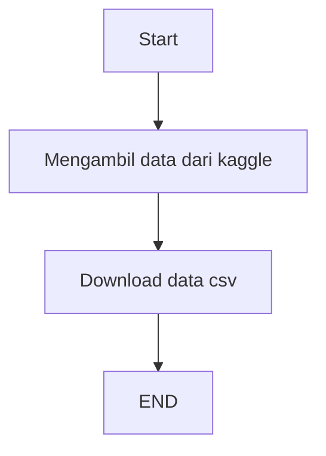
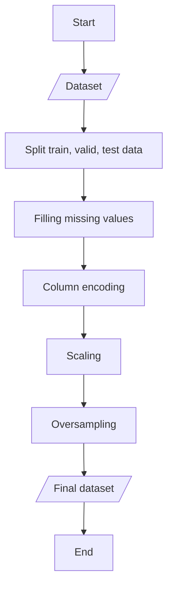
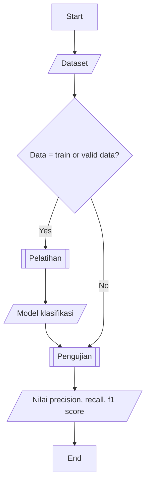

# Description

Car insurance prediction adalah service yang digunakan untuk memprediksi apakah seseorang akan mengajukan klaim asuransi kendaraan atau tidak berdasarkan data input. Inputan dari api yang digunakan berupa data json tentang profil pribadi dan kendaraan user.

## Dataset

Source: https://www.kaggle.com/datasets/sagnik1511/car-insurance-data

Features: 

    - VEHICLE_YEAR
    - ANNUAL_MILEAGE
    - GENDER
    - EDUCATION
    - CHILDREN
    - DUIS
    - MARRIED
    - SPEEDING_VIOLATIONS
    - VEHICLE_OWNERSHIP
    - PAST_ACCIDENTS
    - AGE
    - CREDIT_SCORE
    - DRIVING_EXPERIENCE

Target:

    OUTCOME

## Diagram persiapan data

## Diagram preprocessing data

## Diagram pemodelan dan evaluasi

## Prerequisites

Project ini menggunakan:
    
    Python 3.8.+

## Installing

Pertama buat virtual environments dan install library yang diperlukan berdasarkan `requirements.txt`

    $ python -m venv .venv
    $ source .env/Scripts/activate
    $ pip install -r requirements.txt

Untuk mencoba di local system, gunakan:
    
    $ python src/data_pipeling.py # run data pipeline
    $ python src/preprocessing.py # run preprocessing and feature engineering data
    $ python src/modelling.py # run modeling data

    $ python src/api.py # run api
    $ streamlit run src/interfacest.py # run streamlit untuk menjalankan antarmuka dari service

## Format message prediksi via API:

    http://localhost:8080/predict/
    input_json = {
      "VEHICLE_YEAR": "string",
      "ANNUAL_MILEAGE": 0,
      "GENDER": "string",
      "EDUCATION": "string",
      "CHILDREN": 0,
      "DUIS": 0,
      "MARRIED": 0,
      "SPEEDING_VIOLATIONS": 0,
      "VEHICLE_OWNERSHIP": 0,
      "PAST_ACCIDENTS": 0,
      "AGE": "string",
      "CREDIT_SCORE": 0,
      "DRIVING_EXPERIENCE": "string"
    }

## Format message response dari API:

    "Tidak melakukan klaim"
    atau
    "Melakukan klaim"

## Authors

* Anisa Ulizulfa

## More details

https://medium.com/@ulizulfaanisa/car-insurance-prediction-fadcee422a67